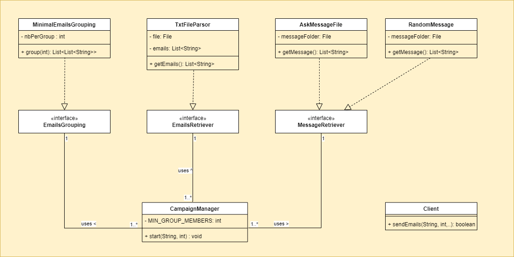
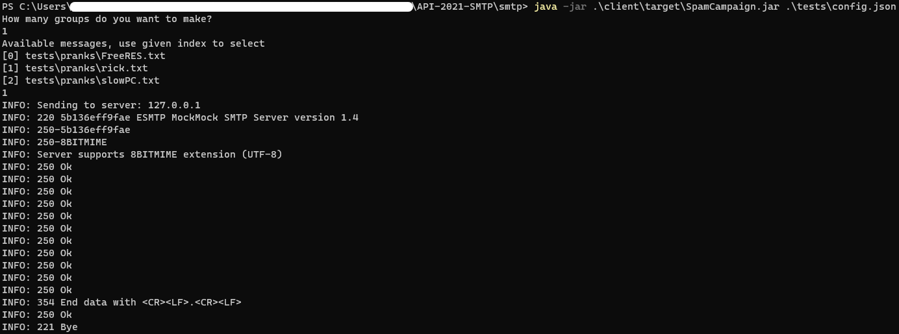

# RES/API - Labo 4 - SMTP

Authors: Jean Gachet, David Gallay, Yanick Thomann

---

## Project Description

This project is a prank email program implementing the [SMTP RFC 5321](https://datatracker.ietf.org/doc/html/rfc5321).

This repository implements a minimal SMTP Client. The client will, given a configuration file, send prank emails by SMTP. The configuration file defines a file containing email addresses and a message folder. A user defined number of groups will be formed using the email address file. For each group, one email address will be used as the apparent sender and the others as the receivers of the prank message. The message folder contains messages as text files. Messages can be chosen at random by the program, or defined manually by the user, and will be used as email body for a specific group.

This repository also includes:

* A minimal SMTP MTA server
* The MockMock SMTP mocking server (integrated in this project using `git subtree`)


## Mockmock

This is a mock server for mailing. It behaves exactly as a real SMTP server would when handling messages and responding to requests, but won't send out the messages.

Its repository is integrated using git [subtree](https://www.atlassian.com/git/tutorials/git-subtree) for it is simpler to use than git submodules.

```bash
git subtree add -P smtp/mockmock git@github.com:dgheig/MockMock.git master
```

### Changes Made To default MockMock Configuration

Some changes were made to use this program

* Fixed java version to Java 11 in `pom.xml`
* Add `Dockerfile` configuration
* Complete `.gitignore` file

```bash
mvn package
```


## Setup Instructions

All commands are run from the `smtp/` folder

### Automatic compilation and running of the environment

To quicky start using the project, you can use the provided bootstrap scripts to setup everything you need in one command:

- Linux: 
  ```bash
  ./bootstrap.sh
  ```
- Windows: 
  ```powershell
  ./bootstrap.bat
  ```


### Want to do it yourself ?

Of course, if running a script is too simple for you, you can also setup the environment yourself by following the step below.

1. Compile your programs

   * Linux

     ```bash
     ./compile.sh
     ```

   * Windows

     ```powershell
     ./compile.bat
     ```
     

2. Launch your server MockMock. We use docker to isolate the process and avoid permission issue with port 25

   ```bash
   docker-compose up -d mockmock  # This will automaticly build the image
   ```

   Alternatively, we can launch our relay server too

   ```bash
   docker-compose up -d
   ```

   The ports are forwarded to localhost:

   * SMTP server (Ports: 25 -> 2525)
   * Mailing Mock Server: MockMock (Ports: 25 -> 2500, 8282 -> 8282)

3. Display all your containers

   ```bash
   docker container ls -f label=RES
   ```

4. Retrieve their ip using the name of the container

   ```bash
   docker inspect smtp_mockmock_1 -f '{{.NetworkSettings.Networks.smtp_default.IPAddress}}'
   ```

5. Edit your configuration file (a sample is provided in `test/config.json`)

   ```bash
   {
       "server": "localhost",
       "port": 2500,
       "emailsFile": "tests/emails.txt",
       "messageFolder": "tests/messages2",
   }
   ```
   
6. Launch your client using your configuration file

   ```bash
   java -jar client/target/SpamCampaign.jar tests/config.json
   ```


## Implementation



* **CampaignManager**: This is the class that will orchestrate the whole  prank. It supervises all other classes and the overall behaviours
* **Client**: The class responsible for sending the email
* **_MessageRetriever_**: Interface defining how the message to be sent will be retrieved for each group
* **_EmailsRetriever_**: Interface defining how the email list will be retrieved.
* **_EmailsGrouping_**: Interface defining how the emails are grouped together 
* **_MinimalEmailsGrouping_,_TxtFileParsor_,_AskMessageFile_, _RandomMessage_** are all classes implementing their respectives interfaces. These classes are used in our projet, but feel free to add more if you'd like.


## Execution example
